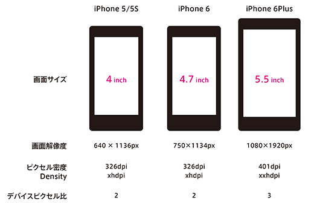

<link href="css/style.css" rel="stylesheet"></link>

  

###2day
- 宿題説明（1.0h）
- 解像度とピクセル比（0.5h）
	- ピクセル（画素）について
	- 解像度について
	- デバイスピクセル比について
- システムフォントとカスタムフォント（0.25h）
	- システムフォントについて
	- iOSアプリケーションで利用可能なフォント
- フラットとスキュアモーフィック（0.25）
- マテリアルデザイン
- iOSヒューマンインターフェースガイドライン 
	- UI要素のサイズ規定
	- UIKitとは

---

#2day
####2/7（日）

## 宿題

##### 完成したLINE NEWSのPS

   

[https://www.dropbox.com/s/47lbgvc09apeny3/line_news.psd?dl=0](https://www.dropbox.com/s/47lbgvc09apeny3/line_news.psd?dl=0)

## 解像度とピクセル比

    

デバイスピクセル比とは、標準解像度の1ピクセルを高解像度デバイスのディスプレイでは何ピクセルとして描画するかを指定するための指数のことです。デバイスピクセル比が2であれば縦横2倍の4ピクセル、3であれば縦横3倍の9ピクセルを標準解像度の1ピクセルとして描画します。HIGでは、デバイスピクセル比2を@×2、デバイスピクセル比3を@×3として表記しています。現在のスマホアプリデザインではデバイスピクセル比2倍を標準としています。

  

### iOSデバイスの画面サイズとピクセル比
   
  
iPhone 5/5SからiPhone 6/6S/6Plusと画面サイズが拡大化しています。またiPhone 6Plusからピクセル密度が400ppiを超え、デバイスピクセル比も3倍となりました。
Android端末ではGalaxy S6などデバイスピクセル比4倍の端末も登場しています。

[Google Material Design Device metrics](https://design.google.com/devices/)

  

##システムフォントについて
   

システムフォントは、スマートデバイスやコンピューターのOSで標準的に使用されるフォントのことです。iOS9ではSanFrancisco（日本語表示はHiraginoSans）が用いられています。 

デザインや開発用のアプリケーションで利用することはできません。制作見本などでSanFranciscoを使用する場合はAppleDeveloperProgramのメンバー登録※1を行い、制作用のSanFranciscoを用意する必要があります。  
※1：Apple Developer Program：https://developer.apple.com/jp/

※Androidの人はNoto Sansを使用する  
[https://www.google.com/get/noto/](https://www.google.com/get/noto/)

  

### iOSアプリケーションで利用可能なフォント
iOSアプリケーションのデザインや開発では、以下のフォント（Custom Font）を指定することもできます。任意のフォントを用いる場合、可読性向上のための配慮を行うようHIGでは強く推奨しています。
     
 

   

##フラットとスキュアモーフィック
スキュアモーフィックデザインとは、主にコンピュータのユーザーインターフェース（UI）において、
実物に似た質感の再現を目指したリアルなデザインのことです。

iOS7以前のデザインはスキュアモーフィックと呼ばれる現実世界に存在するデザインをUIに組み込む傾向がありましたが、2013年のiOS7よりシンプルで無駄のないUIデザイン、通称として呼ばれている「フラットデザイン」推奨しています。例えば天気アプリであれば知りたい天気と気温がすぐ目に着くように、地図であれば可能なかぎり画面いっぱいに地図を広げています。
フラットデザインとは原則的にメタファを使わないデザインのことです。

スキューモーフィズムは、新しいテクノロジーの出現時には非常に有効な手法である。
なぜならば、ユーザーは、既存のオブジェクトやテクノロジーと比較することで使い方を想像することができるからだ。
※世界の成功事例から学ぶ、スマホ以降のインターフェースデザイン UI GRAPHICS

  
  

   

## マテリアルデザイン
マテリアルデザインを直訳すると「物質的なデザイン」という意味です。
マテリアルデザインでは、要素の重なりを物理的にとらえ、平面の中に、明確なZ軸の概念を持たせています。
マテリアルデザインでは、ヘッダーやカード型リスト、ボタンなど、あらゆる要素のベースとなる部分は「紙」のメタファーです。
そして、紙のベース上に乗っている文字やアイコン、写真などは自在に変わる「インク」です。

デザイナーは、マテリアルデザインというフレームワークを採用することで、
トーンや文字サイズ、グリッド設計などに過度なリソースを費やす必要がなくなります。

- フォント
- カラー
- グリッドシステム
- アニメーション

[https://www.google.com/design/spec/material-design/introduction.html](https://www.google.com/design/spec/material-design/introduction.html)

   

## iOSヒューマンインターフェースガイドライン 
iOSのアプリケーションデザインでは、AppleがiOS ヒューマンインターフェイスガイドラインというルールを作ってアプリケーションデザインの指針を提唱しています。
この中でユーザーがアプリケーションデザインを行う際に、3つの指針を意識するように提唱しています。
一つ目めは“Deference:控えめ”、2つ目は"Clarity:明瞭"、3つ目は“Depth:奥行き”です。

[https://developer.apple.com/jp/documentation/UserExperience/Conceptual/MobileHIG/BasicsPart/BasicsPart.html](https://developer.apple.com/jp/documentation/UserExperience/Conceptual/MobileHIG/BasicsPart/BasicsPart.html)

  

### UI要素のサイズ規定

スマートフォンのデザインではボタンなどのユーザーがタップする領域を十分に取るようにしましょう。iOSヒューマンインターフェイスガイドラインでは幅・高さ44ポイント（88ピクセル@×2）以上が必要と述べています。テキストから遷移する場合でも周りに十分な領域がなければ意図しないリンクを選んでしまう可能性があるので注意しましょう。

  

### UIKitとは

UIKitは、アプリケーションの見た目や操作感に統一性を持たすためAppleが予め用意してくれているユーザーインターフェイス・パーツのことです。iOSアプリケーションは、これらのパーツを組み合わせることによって構築されています。

##### iOS 9 GUI (iPhone)
[https://facebook.github.io/design/ios9.html](https://facebook.github.io/design/ios9.html)

[http://ozzik.co/freebies/ios9kit](http://ozzik.co/freebies/ios9kit)

##### iPhone5
[https://www.dropbox.com/s/kn3j2qbvl0409h6/iPhone5.psd?dl=0](https://www.dropbox.com/s/kn3j2qbvl0409h6/iPhone5.psd?dl=0)

##### iPhone6
[https://www.dropbox.com/s/f8irpam6b9nt613/iPhone6.psd?dl=0](https://www.dropbox.com/s/f8irpam6b9nt613/iPhone6.psd?dl=0)

### アイコン

iOSには、「Refresh」、「Action」、「Add」、「Favorites」など、標準のバーボタンアイコンが多数付属しています。できる限り、こういったボタンやアイコンを使用して、アプリケーションの標準的な機能を表すようにします

##### Free vector icons
[http://www.flaticon.com/](http://www.flaticon.com/)