<link href="css/style.css" rel="stylesheet"></link>

#1day
####1/24（日）

## Webサイトデザイン講義（1h）
###画面解像度とページサイズ
　
Web レイアウトを行うにあたって、ユーザーの表示環境を想定することから始めます。まず、PC のディスプレイ解像度の普及サイズを目安にして、 基本的なレイアウト幅と高さを検討して行きます。年々、画面解像度は拡大していく傾向にあります。
　
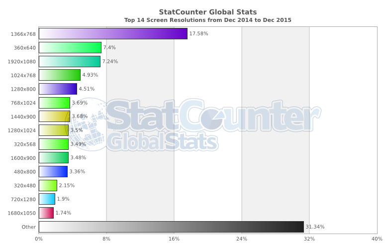

[http://gs.statcounter.com/](http://gs.statcounter.com/)

画面解像度の単位では ppi を使用します。ppi(ピーピーアイ)は、pixel per inch の略で、ピクセル密度の単位がある。1 インチあたりのピク セルの数を表す(1 平方インチあたりではない)。ppi で表したピクセル密度のことを単に ppi と呼ぶことがある。  
現在、一般的な表示解像度は XGA(1024×768 ピクセル)以上と言われています。また Wide XGA(1280×768、1366×768)や SXGA(1280 ×1024)WXGA+(1440×900)、フル HD(1920×1080)も増加傾向にあります。

PCサイトのターゲットディスプレイは現在、1280x80ピクセルが一般的。  
PCサイトの横幅は、970px〜1170pxの間が多い。

   

#### レティナディスプレイ

Retina ディスプレイとは、Apple が iPhone 4 から採用した高解像度ディスプレイのことです。

Retina ディスプレイの大きな特徴は画面解像度の高さにあります。1 ピクセルの幅が 78 ミクロンと肉眼では見えない程度に小型化され、画面サ イズは従来のiPhone 3やiPhone 3GSと同じ3.5インチのまま、960×640ピクセル、解像度326ppiと4倍以上の解像度を実現しています。 コントラスト比も従来比 4 倍で、より鮮明で深みのある色を表現できます。新しい iPad では、解像度 264ppi の 2,048×1,536 ピクセルを実現し ています。

Retina ディスプレイの登場から普及によって Web デザインでは 72ppi の等倍画像と Retina 用の 2 倍画像を用意して JavaScript で分岐するケー スが広がると予想されています。

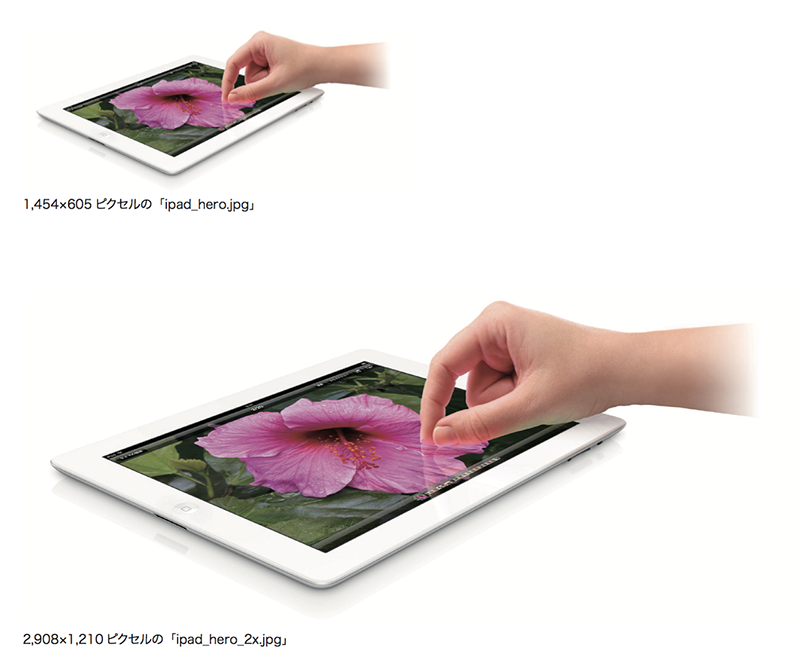

[http://foodsense.is/](http://foodsense.is/)

   

### PhotoshopでWebデザイン

1.表示サイズ

皆さんが使っているモニターはレティナディスプレイなので、
Photoshopの表示を200%にしてデザインを作成

2.カラー設定

イメージ > モード > RGBカラー

3.解像度

イメージ > 画像解像度 > 72pixl

### ブラウザ

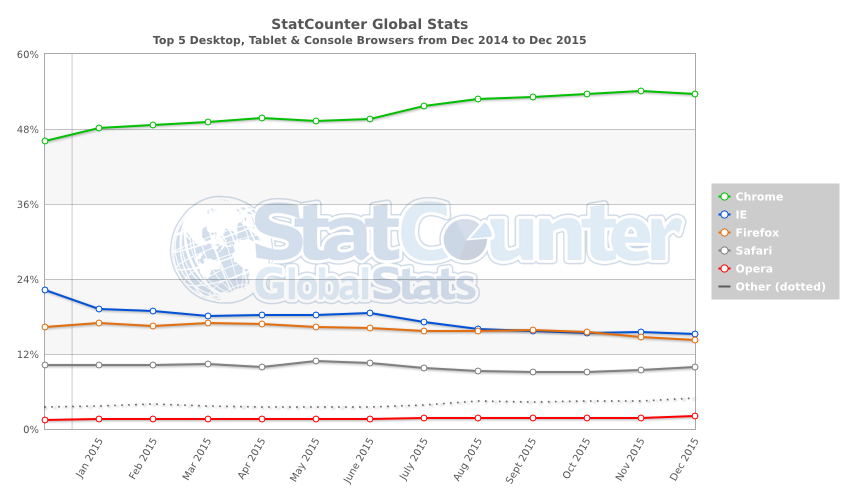

| 順位 | プロダクト |シェア |
|:----------:|:----------:|:----------:|
| 1 | Microsoft Internet Explorer 11.0 | 27.22% |
| 2 | Chrome 43.0 | 17.55% | 
| 3 | Microsoft Internet Explorer 8.0 | 13.58% |
| 4 | Firefox 38 | 9.03% |
| 5 | Microsoft Internet Explorer 9.0 | 6.76% |
| 6 | Microsoft Internet Explorer 10.0 | 5.55% |
| 7 | Safari 8.0 | 2.87% |
| 8 | Chrome 36.0 | 2.36% |
| 9 | Chrome 31.0 | 1.37% |
| 10 | Chrome 42.0 | 1.02% |

※2015年6月現在

   

### ファーストビュー

Web サイトにアクセスしたらすぐに表示確認できる領域のことをファーストビューと呼びます。これはターゲットディスプレイのサイズに収まる大きさ のことです。ターゲットディスプレイは現在 1024×768 ピクセル(1280×768 ピクセルサイズと拮抗している)が一般的ですので、この画面解像 度でブラウズする場合、ブラウザのウインドウやツール領域を差し引くた実質のレイアウトサイズは幅が 960 ピクセル、高さが 600 ピクセル程度が 妥当と言われています。Web のレイアウトでは、このサイズ辺りで作られることがが多いです。 

Web デザインではこのファーストビューに最も訴求したい情報を収めることが重要とされています。

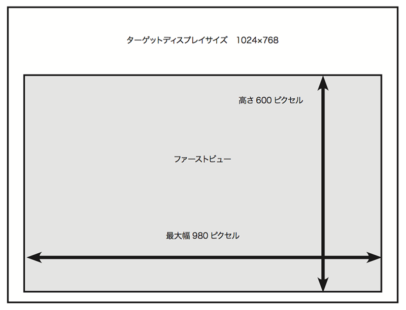

   

### ユーザー目線の流れ
「グーテンベルク・ダイヤグラム」とは均等に配置された同質の情報を見る際の、一般的な視線の流れのパターンを表した図式のことで、「人間の 目は左上から右下方向へ遷移する」と言われています。 こういった視線の流れのパターンは、もともとエディトリアルデザインでは使われている技法ですが、Web デザインでも左上にロゴや重要な情報を 配置してユーザーの目線を惹くレイアウト配置を行います。
テキストをレイアウトする場合には、左上・右下に重要なコンテンツを配置します。 これはドキュメントを読む際の視線の動きであって、媒体によって効果的な導線が異なってきます。
Web デザインの場合は、右利きのユーザーの多さを考慮して右カラムにはリンクを誘導する広告バナーを配置するパターンが多いです。

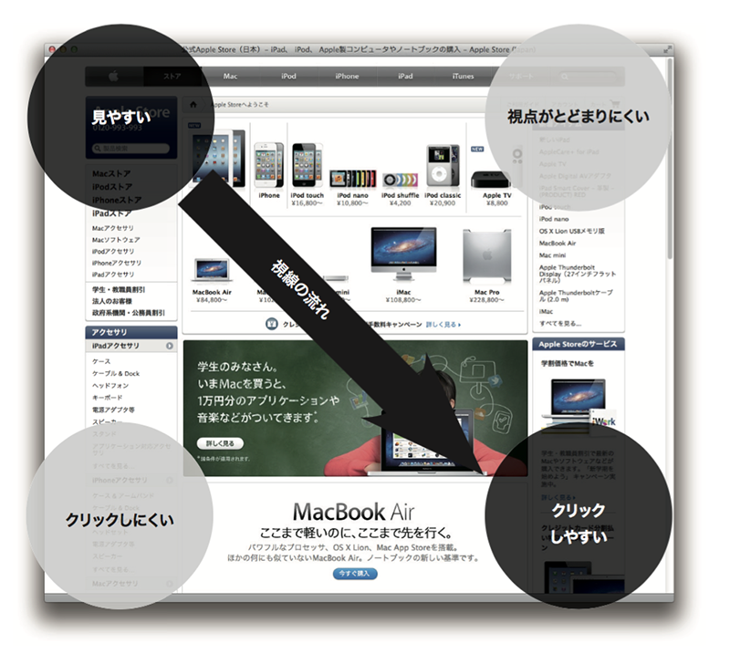

   

### ブラウザ上のレイアウト

Web デザインのレイアウトには、が固定レイアウトと、可変(リキッド)レイアウトがあります。 固定レイアウトで中央寄せを設定する場合は大きめのディスプレイで表示しているユーザーはレイアウトがセンターに固定されて、ディスプレイのサ イズにあわせて左右に余白ができます。ターゲットディスプレイに収まる固定幅を画面中央に寄せる基本的なレイアウトタイプで最も汎用性が高く なります。

リキッドレイアウトはユーザーのディスプレイサイズに合わせてレイアウトが変えられるタイプです。 メリットとしては、ユーザの端末環境に依存することがなくタブレット端末でもスマートフォンでも、旧型の解像度の低い PC でも情報をレイアウト の範囲に収めて表示できます。

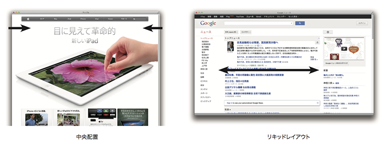

   

### レスポンシブ・ウェブデザイン

スマートフォンの普及にあわせて、レスポンシブウェブデザインと呼ばれる、PC 用とスマートフォン用の 2 つの CSS を閲覧端末で切り替える技術 も普及しています。このメリットはどちらの端末にも最適化したレイアウトでスムーズにコンテンツを閲覧することができることです。また CSS の方の みを端末ごとに切り替えるために、HTML ファイルは一元化できます。

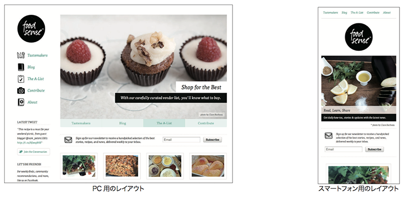

   

### スキュアモーフィックデザインとフラット

グラデーションやシャドウを使って現実世界に近づける表現をスキュアモーフィックデザインと呼びます。
iOS7以前に使われていました。現在は平面的なフラットデザインが主流。Googleではフラットデザインに3D表現を加えたマテリアルデザインを推奨しています。

### フォント

###デバイスフォント
デバイスフォントとは、MacOSやWindowsなどのコンピューターに予めインストールされているフォントのことです。代表的なものとして、下記のフォントがあります。

###Webフォント
サーバー上にあるフォントを表示する技術です。コンピューターにインストールされていないフォントもブラウザで表示できるため、ユーザー環境に左右されることが無くなります。
しかし、容量の大きいフォントはダウンロードに時間がかかるため、サイト観覧時に表示が遅くなるというデメリットもあります。下記は、Webフォントを提供しているサイトです。

####Google Fonts
⇒https://www.google.com/fonts  
**フォント例：**  
Noto Sans（和文/欧文、サンセリフ）、Roboto（欧文、サンセリフ）

####Adobe Typekit
⇒https://typekit.com/  
**フォント例：**  
Adobe Garamond Pro（欧文、セリフ）、Futura PT（欧文、サンセリフ）

### UI/UXの違い

####ユーザーインターフェース(UI)
UIはUser Interfaceの略です。Interfaceとは「接点、接触面」という意味で、UIはユーザーと製品・ サービスの接触面を指すので、「ユーザーの目に触れる部分使用する部分」はすべてUIとみなすこ とができます

####ユーザーエクスペリエンス(UX
Experienceとは「体験、経験」を意味し、UXとは「ユーザーが製品・サービスを通じて得られる体 験」を指します。サービスを利用する一連の行動の中で、ユーザーが感じたこと全てがUXになる、 と捉えましょう。例えばWebサイトの場合、デザインがキレイ、フォントが読みやすい、お問い合 せフォームや購入ページまでの導線がわかりやすいといった表層的な部分から、商品を注文したら すぐに届いた、対応が丁寧だった、商品のクオリティが高いというようなサービスの質に関わる部 分も「UX」です。

### サイトマップ

ペルソナやユーザーシナリオの作成が終われば、次はサイトマップ作成に入ります。
そのサイトマップ作成の為にサイトコンテンツの洗い出し、精査・カテゴリ化をします。

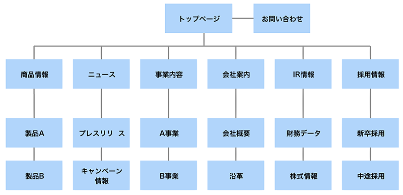

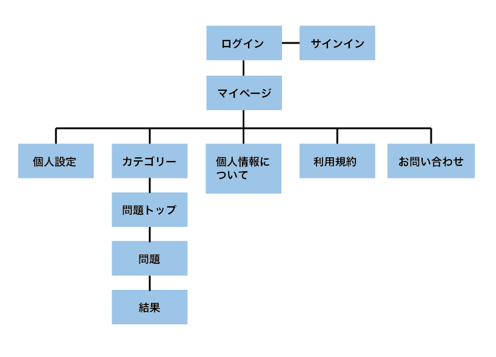

Webサイト内のページ構成を分類し、一覧にしたもの。 カテゴリに分類した上で、ツリー状の階層構造で書かれてあること が多く、作成に使用するツールは、PowerPoint、Illustratorなどが 多いです。

http://goo.gl/lbLsn

   

### ワイヤーフレーム

Webページの大まかなコンテンツやレイアウトを示した構成図。
主にレイアウトの確認、メニュー構成の確認、要素の強弱の確認などを目的に作成する。

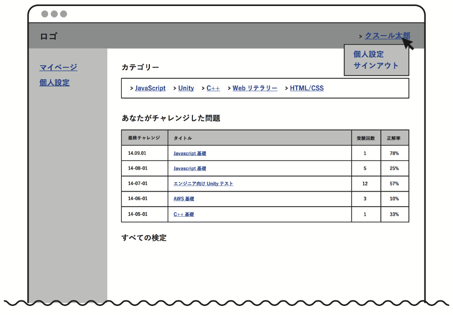

   

[Wireframe Showcase]
http://www.wireframeshowcase.com/

---
### Webサイトトレース（2.5h）
　ボタン、Webサイト、レイアウト

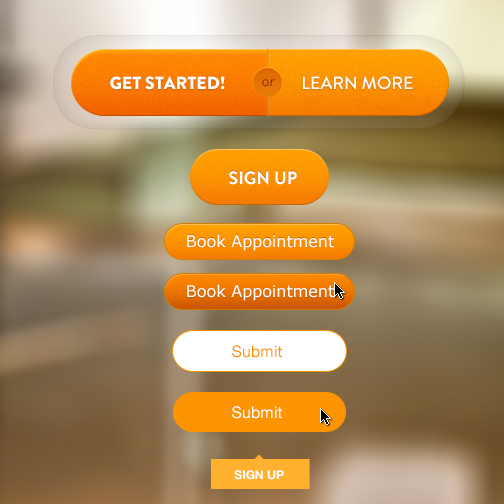

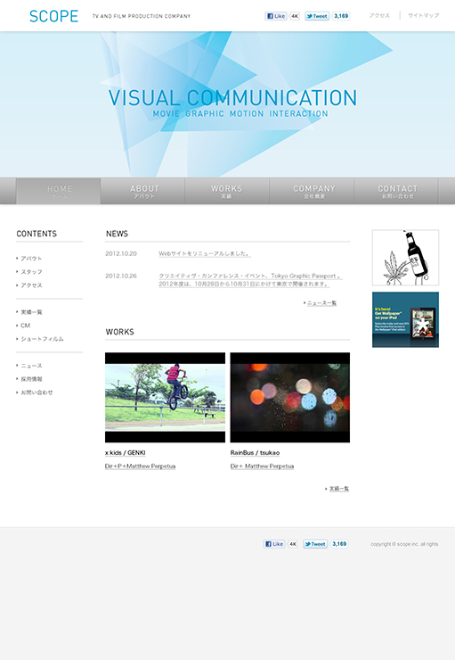

---

##スマホサイトデザイン講義（1h）

### グリッドデザイン

グリッドデザインとは

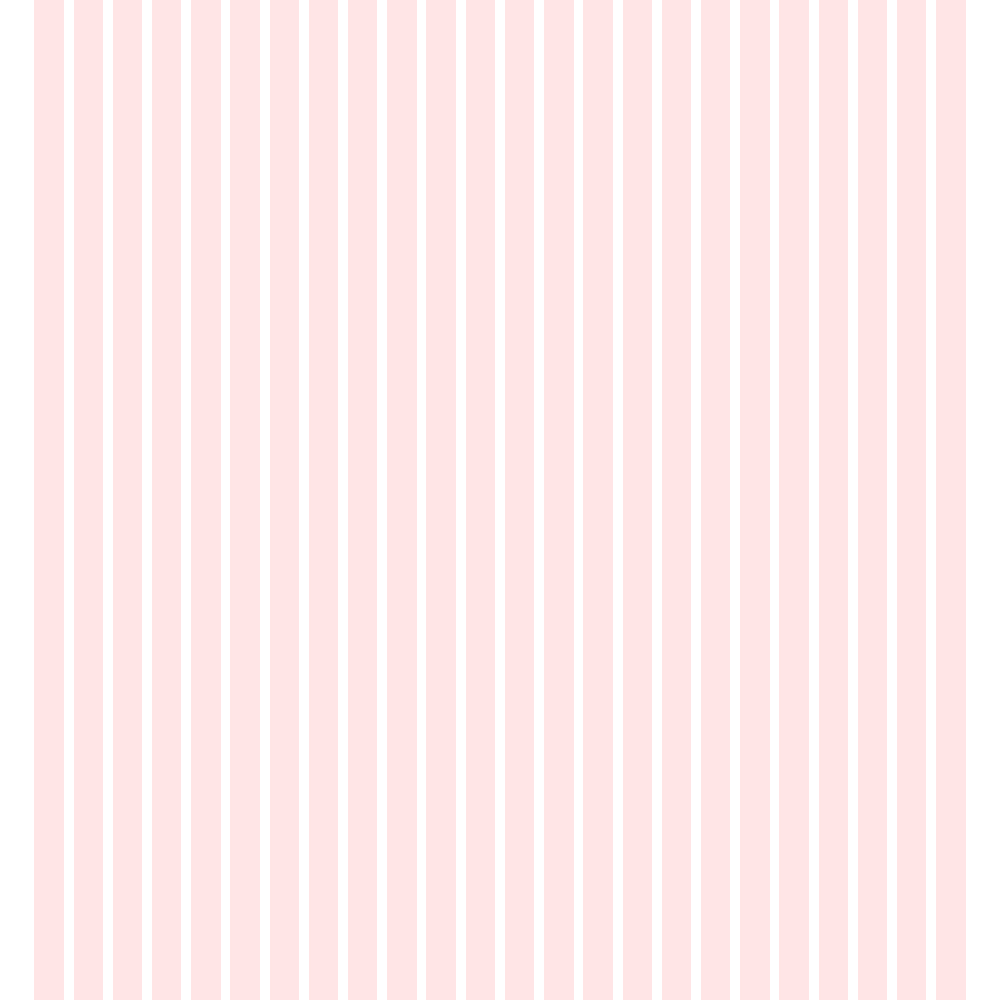
   

### ペーパープロトタイプ

ペーパープロトタイプとは、紙のプロトタイプを作成し、実際に操作して使い勝手を試すことです。

Webサイトやアプリケーションの開発はワイヤーフレーム→デザインカンプ→実装の順で進めます。その場合、実装が完了してから情報設計やインターフェースが使いづらいと分かっても、最初から やり直すには時間がかかってしまうため、修正を断念せざるおえない場合がよくあります。その為 に前段階でテストし、早期に問題を見つけることができるペーパープロトタイプが注目されています。

HTMLやPhotoshopで作成し検証するよりも工数が小さいこともメリットです。

従来はワイヤーフレームを作成することが基本でしたが、現在は 代わりにペーパープロトタイプを 使ったり、また併用することが多くなっています。 また、専用のWebプロトタイピングツールを使うことで、より実際のページを使う感覚でシュミ レーションすることが可能です。

   

####プロトタイピングツール

ペーパーモックアップをスキャナやスマホのカメラで撮影し、ブラウザ上で画面にインタラクションを付けることができるサービスです。

---

### スマホサイト ペーパープロトタイプ（1h）
　prott使い方

--

国内外で便利なペーパープロトタイプツールがいくつもありますが、
WEBとmobileの画面でテストできることから"invision"というサービスがオススメです。  
[http://www.invisionapp.com/](http://www.invisionapp.com/)

ペーパープロトタイプのテンプレート 

Prott
https://prottapp.com/

   

---

### 宿題説明（0.5h）
　アプリペーパープロトタイプ
　ニュースアプリ（ターゲット、コンセプト有）
　ニュースアプリダウンロード
　
　
　
　
　

#2日目 2/7（日）

## モバイルアプリ講義（1h）
　マテリアル、iOS、サイズ、解像度、ピクセル比

## デザイン作業（4.5h）
　ニュースアプリ（ターゲット、コンセプト有）
　Photohop

## 発表（0.5）
　良いデザイン2点ほど

---

Prattのアカウント作って欲しい
Photoshopどのくらい使えるか
すでに勉強した詳細なカリキュラム知りたい
筆記用具
ペーパープロトタイプ紙印刷

モバイル優先？
授業後半でWebサイトのプログラミング入っているので、
Webデザインも入れておきたい