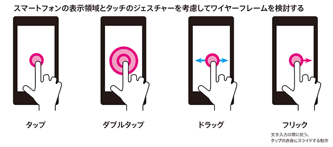
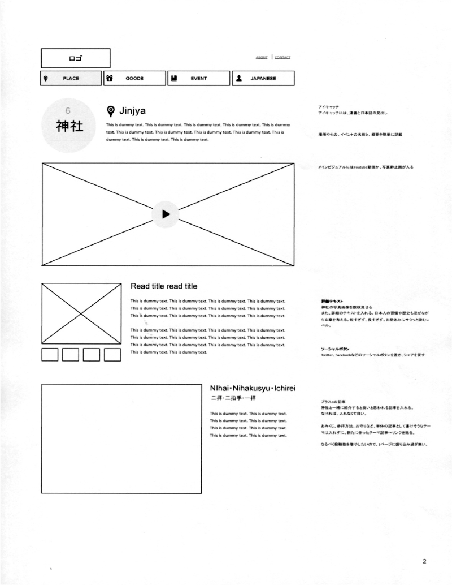

<link href="css/style.css" rel="stylesheet"></link>

#1day
####1/24（日）

この授業で学ぶこと

Webデザインはやったが、
アプリケーション、モバイルアプリケーション（iOS、Android）
について学ぶ

どんなアプリ使ってますか？

今日からデザインを意識してみるようにしてみてください。

### UI/UXの違い

####ユーザーインターフェース(UI)
UIはUser Interfaceの略です。Interfaceとは「接点、接触面」という意味で、UIはユーザーと製品・ サービスの接触面を指すので、「ユーザーの目に触れる部分使用する部分」はすべてUIとみなすこ とができます

####ユーザーエクスペリエンス(UX
Experienceとは「体験、経験」を意味し、UXとは「ユーザーが製品・サービスを通じて得られる体 験」を指します。サービスを利用する一連の行動の中で、ユーザーが感じたこと全てがUXになる、 と捉えましょう。例えばWebサイトの場合、デザインがキレイ、フォントが読みやすい、お問い合 せフォームや購入ページまでの導線がわかりやすいといった表層的な部分から、商品を注文したら すぐに届いた、対応が丁寧だった、商品のクオリティが高いというようなサービスの質に関わる部 分も「UX」です。

###ジェスチャー

  
テキスト

---

  
テキスト

---

###ユーザの指の動き

  
テキスト

---

### 画面遷移図

### ワイヤーフレーム

Webページの大まかなコンテンツやレイアウトを示した構成図。
主にレイアウトの確認、メニュー構成の確認、要素の強弱の確認などを目的に作成する。

   

[Wireframe Showcase]
http://www.wireframeshowcase.com/

### ペーパープロトタイプ

ペーパープロトタイプとは、紙のプロトタイプを作成し、実際に操作して使い勝手を試すことです。

Webサイトやアプリケーションの開発はワイヤーフレーム→デザインカンプ→実装の順で進めます。その場合、実装が完了してから情報設計やインターフェースが使いづらいと分かっても、最初から やり直すには時間がかかってしまうため、修正を断念せざるおえない場合がよくあります。その為 に前段階でテストし、早期に問題を見つけることができるペーパープロトタイプが注目されています。

HTMLやPhotoshopで作成し検証するよりも工数が小さいこともメリットです。

従来はワイヤーフレームを作成することが基本でしたが、現在は 代わりにペーパープロトタイプを 使ったり、また併用することが多くなっています。 また、専用のWebプロトタイピングツールを使うことで、より実際のページを使う感覚でシュミ レーションすることが可能です。

   

####プロトタイピングツール

ペーパーモックアップをスキャナやスマホのカメラで撮影し、ブラウザ上で画面にインタラクションを付けることができるサービスです。

---

### ペーパープロトタイプ（1h）
　prott使い方

--

国内外で便利なペーパープロトタイプツールがいくつもありますが、
WEBとmobileの画面でテストできることから"invision"というサービスがオススメです。  
[http://www.invisionapp.com/](http://www.invisionapp.com/)

ペーパープロトタイプのテンプレート 

Prott
https://prottapp.com/

   

---

### 宿題説明（0.5h）
　アプリペーパープロトタイプ
　ニュースアプリ（ターゲット、コンセプト有）
　ニュースアプリダウンロード
　
　
　
　
　

#2日目 2/7（日）

## モバイルアプリ講義（1h）
　マテリアル、iOS
　サイズ、解像度、ピクセル比

## デザイン作業（4.5h）
　ニュースアプリ（ターゲット、コンセプト有）
　Photohop

## 発表（0.5）
　良いデザイン2点ほど

---

Prattのアカウント作って欲しい
Photoshopどのくらい使えるか
すでに勉強した詳細なカリキュラム知りたい
筆記用具
ペーパープロトタイプ紙印刷

モバイル優先？
授業後半でWebサイトのプログラミング入っているので、
Webデザインも入れておきたい