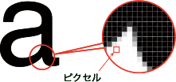
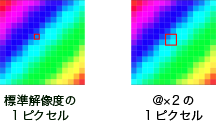
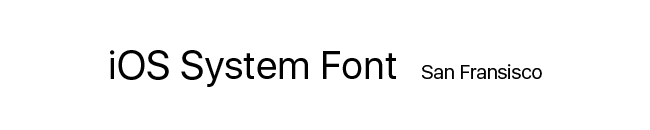
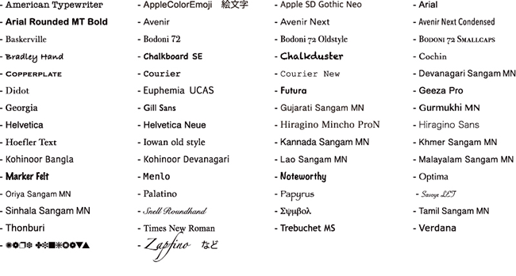

<link href="css/style.css" rel="stylesheet"></link>

#1day
- これから勉強すること
- UI/UXの違い
	- ユーザーインターフェース(UI)
	- ユーザーエクスペリエンス(UX)
- ジェスチャー
	- ユーザの指の動き
- 画面遷移図
- ペーパープロトタイプ
	- プロトタイピングツール

#2day
- 解像度とピクセル比
	- ピクセル（画素）について
	- 解像度について
	- デバイスピクセル比について
- システムフォントとカスタムフォント
	- システムフォントについて
	- iOSアプリケーションで利用可能なフォント
- ガイドライン
- UI要素のサイズ規定

---

#1day
####1/24（日）

この授業で学ぶこと

Webデザインはやったが、
アプリケーション、モバイルアプリケーション（iOS、Android）
について学ぶ

どんなアプリ使ってますか？

今日からデザインを意識してみるようにしてみてください。

### UI/UXの違い

####ユーザーインターフェース(UI)
UIはUser Interfaceの略です。Interfaceとは「接点、接触面」という意味で、UIはユーザーと製品・ サービスの接触面を指すので、「ユーザーの目に触れる部分使用する部分」はすべてUIとみなすこ とができます

####ユーザーエクスペリエンス(UX
Experienceとは「体験、経験」を意味し、UXとは「ユーザーが製品・サービスを通じて得られる体 験」を指します。サービスを利用する一連の行動の中で、ユーザーが感じたこと全てがUXになる、 と捉えましょう。例えばWebサイトの場合、デザインがキレイ、フォントが読みやすい、お問い合 せフォームや購入ページまでの導線がわかりやすいといった表層的な部分から、商品を注文したら すぐに届いた、対応が丁寧だった、商品のクオリティが高いというようなサービスの質に関わる部 分も「UX」です。

   

###ジェスチャー

  

---

  

---

###ユーザの指の動き

  

---

###名称

・スプラッシュ
・オンボーディング
・メインアクションバー（Android）
・ナビゲーションバー（Android）
・ツールバー（iPhone）/ボトムバー（Android）
・モーダルウインドウ
・タブバー
・セグメンテッドコントロール
・ドロップダウン
・ドリルダウン
・アコーディオン
・バッジ

分かりやすく、使いやすいデザインを生み出す工夫　池田 拓司
http://www.slideshare.net/schoowebcampus/20131225schoo

---

### 画面遷移図

  

### ペーパープロトタイプ

ペーパープロトタイプとは、紙のプロトタイプを作成し、実際に操作して使い勝手を試すことです。

Webサイトやアプリケーションの開発はワイヤーフレーム→デザインカンプ→実装の順で進めます。その場合、実装が完了してから情報設計やインターフェースが使いづらいと分かっても、最初から やり直すには時間がかかってしまうため、修正を断念せざるおえない場合がよくあります。その為 に前段階でテストし、早期に問題を見つけることができるペーパープロトタイプが注目されています。

HTMLやPhotoshopで作成し検証するよりも工数が小さいこともメリットです。

従来はワイヤーフレームを作成することが基本でしたが、現在は 代わりにペーパープロトタイプを 使ったり、また併用することが多くなっています。 また、専用のWebプロトタイピングツールを使うことで、より実際のページを使う感覚でシュミ レーションすることが可能です。

   

####プロトタイピングツール

ペーパーモックアップをスキャナやスマホのカメラで撮影し、ブラウザ上で画面にインタラクションを付けることができるサービスです。

---

### ペーパープロトタイプ（1h）
　prott使い方

--

国内外で便利なペーパープロトタイプツールがいくつもありますが、
WEBとmobileの画面でテストできることから"invision"というサービスがオススメです。  
[http://www.invisionapp.com/](http://www.invisionapp.com/)

ペーパープロトタイプのテンプレート 

Prott
https://prottapp.com/

   

---

### 宿題説明（0.5h）
　アプリペーパープロトタイプ
　ニュースアプリ（ターゲット、コンセプト有）
　ニュースアプリダウンロード
　
　
　
　
　

#2日目 2/7（日）

## モバイルアプリ講義（1h）
　マテリアル、iOS

###解像度とピクセル比

####ピクセル（画素）について
  
ディスプレイなどで画像を表示する際、画像は色情報を持つ小さな正方形の集合として表示されます。ディスプレイ表示におけるこの最小の正方形はピクセル（px）と呼ばれ、デジタル画像の幅や高さを計る際の単位としても用いられます。また、ピクセルで構成された画像のことをビットマップ画像と呼びます。
<!--　ピクセルには1px = ◯◯mmといった規則はなく、ディスプレイごとにその大きさは異なります。例えば、駅前の電光掲示板とスマートフォンでは映し出す画像が同じでも、ピクセルの物理的な大きさは異なるといった具合です。-->

####解像度について
   
解像度は、ビットマップ画像におけるピクセルの密度を示す指数のことで、1インチ中に幾つのピクセルが並んでいるかをppi（Pixel Per Inch）を用いて示します。解像度は、“1インチのライン上にピクセルが幾つ並ぶか”を示す指数であり、1インチ×1インチの領域中（11平方インチ）に存在するピクセルの総数（総画素数）を示す指数ではありません。  
コンピュータなどのディスプレイは通常72ppiで表示されており、この解像度を標準解像度と呼びます。  

####デバイスピクセル比について
    
デバイスピクセル比とは、標準解像度の1ピクセルを高解像度デバイスのディスプレイでは何ピクセルとして描画するかを指定するための指数のことです。デバイスピクセル比が2であれば縦横2倍の4ピクセル、3であれば縦横3倍の9ピクセルを標準解像度の1ピクセルとして描画します。 
※Appleのヒューマン・インターフェイス・ガイド（以下HIG）では、デバイスピクセル比2は@×2、デバイスピクセル比3は@×3と表記されます。

---

###ガイドライン

####iOSヒューマンインターフェイスガイドライン
https://developer.apple.com/jp/documentation/UserExperience/Conceptual/MobileHIG/BasicsPart/BasicsPart.html

#####UI要素のサイズ規定

HIGでは、ユーザが快適にUI要素を操作するための最小サイズを以下のように規定しています。
  
iOS ヒューマンインターフェイス ガイドライン pdf
https://developer.apple.com/jp/documentation/MobileHIG.pdf

####Material design - Google design guidelines 
https://www.google.com/design/spec/material-design/introduction.html

---

###システムフォントとカスタムフォント

####システムフォントについて
   

システムフォントは、スマートデバイスやコンピューターのOSで標準的に使用されるフォントのことです。iOS9ではSanFrancisco（日本語表示はHiraginoSans）、AndroidではNotoSansCJKjpが用いられています。  
SanFranciscoは、読みやすさを追求し開発された特殊フォントで、表示サイズによってステムやカウンターなどの太さを自動調整し表示することができます。しかし、デザインや開発用のアプリケーションで利用することはできません。制作見本などでSanFranciscoを使用する場合はAppleDeveloperProgramのメンバー登録※1を行い、制作用のSanFranciscoを用意する必要があります。  
※1：Apple Developer Program：https://developer.apple.com/jp/

---

####iOSアプリケーションで利用可能なフォント
iOSアプリケーションのデザインや開発では、以下のフォント（Custom Font）を指定することもできます。任意のフォントを用いる場合、可読性向上のための配慮を行うようHIGでは強く推奨しています。
     
  

---

## デザイン作業（4.5h）
　ニュースアプリ（ターゲット、コンセプト有）
　Photohop

## 発表（0.5）
　良いデザイン2点ほど

---

Prattのアカウント作って欲しい
Photoshopどのくらい使えるか
すでに勉強した詳細なカリキュラム知りたい
筆記用具
ペーパープロトタイプ紙印刷

モバイル優先？
授業後半でWebサイトのプログラミング入っているので、
Webデザインも入れておきたい