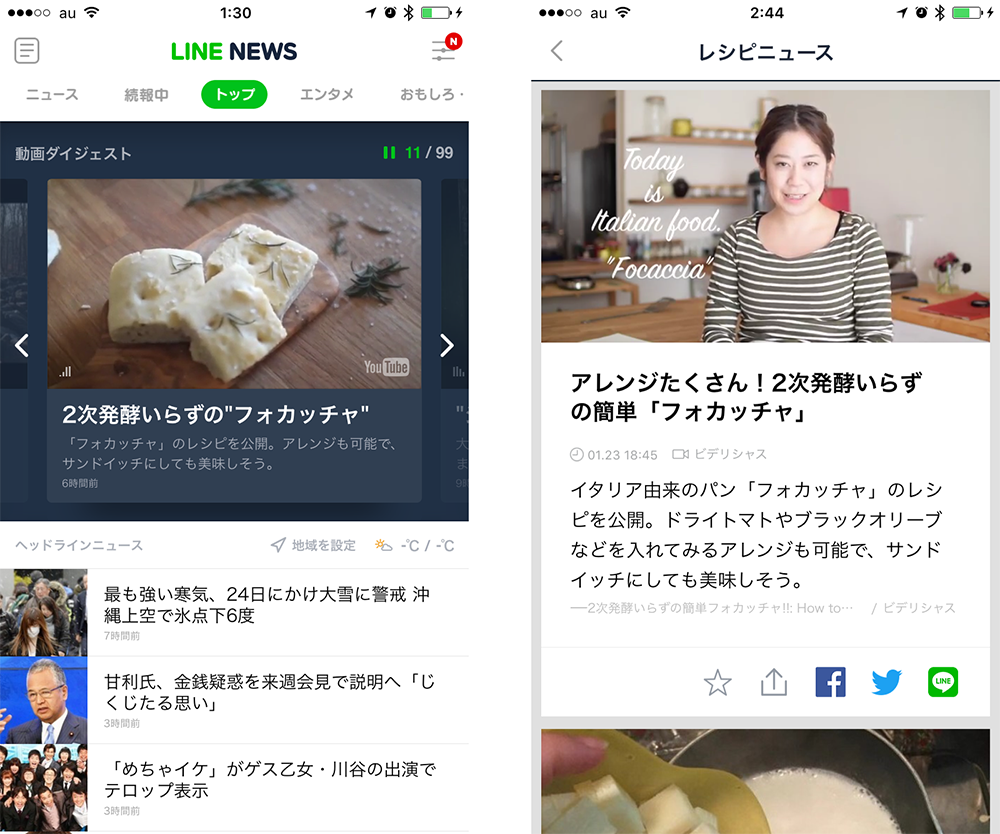

<link href="css/style.css" rel="stylesheet"></link>

  

###1day
- これから勉強すること（1.5）
- UI/UXの違い
	- ユーザーインターフェース(UI)
	- ユーザーエクスペリエンス(UX)
	- IA（インフォメーションアーキテクト）
- ジェスチャー
	- ユーザの指の動き
	- 名称
- 課題テーマ
- コンセプト
- ターゲット
	- ペルソナ
	- 課題例
- ユーザーシナリオ
- グループワーク（1.5h）
- 画面遷移図
- ペーパープロトタイプ
	- プロトタイピング（2h）
	- プロトタイピングツールの使い方（0.5h）（Invison）
- 宿題（0.5h）

###2day
- 解像度とピクセル比
	- ピクセル（画素）について
	- 解像度について
	- デバイスピクセル比について
- システムフォントとカスタムフォント
	- システムフォントについて
	- iOSアプリケーションで利用可能なフォント
- フラットとスキュアモーフィック
- ガイドライン
	- UI要素のサイズ規定

---

#1day
####1/24（日）

####この授業で学ぶこと

Webデザインは授業で少し勉強しましたが、  
アプリケーション、モバイルアプリケーション（iOS、Android）  
について学んでいきましょう。

技術的なツールの使い方などではなく、  
アプリやWebサイトの考え方を実際に手を動かしながら
体験していきましょう。

どんなアプリ使ってますか？？

自分のiPhone画面見せる

今日からデザインを意識して見るようにしてみてください。

--

   

## UI/UXの違い

昨日、入学前の生徒を対象にアプリUI体験授業を行いました。
UImデザイナーの需要がここ3年で急激に増えていますが、
UIデザインを希望する人も増えるようです。

####ユーザーインターフェース(UI)
UIはUser Interfaceの略です。Interfaceとは「接点、接触面」という意味で、UIはユーザーと製品・ サービスの接触面を指すので、「ユーザーの目に触れる部分使用する部分」はすべてUIとみなすこ とができます

####ユーザーエクスペリエンス(UX)
Experienceとは「体験、経験」を意味し、UXとは「ユーザーが製品・サービスを通じて得られる体 験」を指します。サービスを利用する一連の行動の中で、ユーザーが感じたこと全てがUXになる、 と捉えましょう。例えばWebサイトの場合、デザインがキレイ、フォントが読みやすい、お問い合 せフォームや購入ページまでの導線がわかりやすいといった表層的な部分から、商品を注文したら すぐに届いた、対応が丁寧だった、商品のクオリティが高いというようなサービスの質に関わる部 分も「UX」です。

####(IA)

   

##ジェスチャー

スマートフォンの表示領域とタッチのジェスチャーを考慮してワイヤーフレームを検討する

  

iPhone6で画面上部をクリックする場合は、指が届かない  
ホームボタンを2回タップすることで、画面が下る。（簡易アクセス）

3D Touch

   

##ユーザの指の動き

  
http://gigazine.net/news/20141209-ios-android-ux-design/

スマートフォンはコンパクトなことから、様々な場所で私用されます。

####シュチュエーション

- 片手で操作
- 片手で持ってもう一方で画面操作
- 両手で操作
- スマホを置いて操作

   

##名称

####Question
iOS、Android、Web、  
それぞれ、どれに適したアプリ？

#####空想のアプリ「植物辞典」

####GUIの名称

- メインアクションバー（Android）
- ナビゲーションバー（iPhone）
- トップバー（Android）
- タブバー（iPhone）
- スピナー（ドロップダウン）（Android）
- セグメンテッドコントロール（iPhone）

※最低限覚えてほしい名称。

分かりやすく、使いやすいデザインを生み出す工夫　池田 拓司
[http://www.slideshare.net/schoowebcampus/20131225schoo](http://www.slideshare.net/schoowebcampus/20131225schoo)

iOS、Androidのガイドラインについては、次週に少し触れます。

####その他の名称

他にも沢山...  
現場に入ったら、ディレクターやエンジニアとコミュニケーションするために  
覚えることが必須です。

- スプラッシュ
- オンボーディング
- モーダルウインドウ
- タブバー
- セグメンテッドコントロール
- ドロップダウン
- ドリルダウン
- アコーディオン
- バッジ

   

##課題テーマ

####ニュースアプリ + α

ニュースにプラスαのテーマを足し、アプリの企画を考えてください。  
チームでアイデアを出し合い、次週デザインを個々で起こします。

 

##コンセプト

####5w1hの例

##ターゲット

####ペルソナ

#####ターゲットユーザーの代表的な人格を設定した仮想の人物

ペルソナは、製品・サービスの目的やコンセプトをより明確にするために、ターゲットユーザーの代表的・典型的な人格を設定した、架空のユーザーのこと。  
対象となるユーザーの「人となり」が想像しやすいように小さなことでも可能な限り具体的に記述する。


これを設定することにより、異なる分野や立場の人々を含むあらゆる関係者間でイメージやビジョンの共有することができます。それにより、ブレの少ない、精度の高い検討や効率的な開発を目指すことができます。  

 

####なぜターゲットユーザーやペルソナを設定するのか?

#####クライアントや制作者の主観を排除し、ユーザー目線でサイト作りをするため

クライアントやデザイン・開発側の希望・思い込み・都合ではなく、成果を出すためには、そのサイト/サービスを使う「ユーザー」の行いたいコト、達成したいコ
トを常に考慮しながら、開発検討を行うことが求められます。


このように、クライアントや制作側の主観を取り除くために、ターゲットユーザーをより具体化させた仮想人物「ペルソナ」を設定し、そのペルソナがどう考えるか/行動するかを考えながらコンセプトをまとめていくことが重要になります。

 

####ニュースアプリ例

左上から  
ニュース、キュレーションアプリ一覧。

- グノシー
- Yahoo!ニュース
- Spotlight
- cakes
- 産経新聞
- Antenna
- line news
- NewsPics

 

   

## ユーザーシナリオ

####利用パターンをシュミレートし、ストーリー化する事

ペルソナが製品やサービスなどと、どのような心理、動機付け、期待を持って、どの ような状況で接触するか、また、どのような操作を行い(あるいは中断され)、最終 的なゴールは何かなど、時間を追って、ストーリーとして描写します。

ストーリーには、場所、時間や状況、ユーザーの思考、心理、認知、発話、動作や操作、また、画面の動作や状況などを記述していきます。また、シーンに関わるユーザーの周りの人々などについても、同様に記述が必要な場合があります。

シナリオはチームで考える。

   

## 画面遷移図

  

それでは、グループでブレインストーミングしましょう。

   

## ペーパープロトタイプ

ペーパープロトタイプとは、紙のプロトタイプを作成し、実際に操作して使い勝手を試すことです。

Webサイトやアプリケーションの開発はワイヤーフレーム→デザインカンプ→実装の順で進めます。その場合、実装が完了してから情報設計やインターフェースが使いづらいと分かっても、最初から やり直すには時間がかかってしまうため、修正を断念せざるおえない場合がよくあります。その為 に前段階でテストし、早期に問題を見つけることができるペーパープロトタイプが注目されています。

HTMLやPhotoshopで作成し検証するよりも工数が小さいこともメリットです。

従来はワイヤーフレームを作成することが基本でしたが、現在は 代わりにペーパープロトタイプを 使ったり、また併用することが多くなっています。 また、専用のWebプロトタイピングツールを使うことで、より実際のページを使う感覚でシュミ レーションすることが可能です。

   

####プロトタイピングツール

国内外で便利なペーパープロトタイプツールがいくつもありますが、  
WEBとmobileの画面でテストできることから"invision"というサービスがオススメです。

####Invision
[http://www.invisionapp.com/](http://www.invisionapp.com/)

 

####スキャンアプリ「CamScanner」
ペーパープロトタイプをカメラで印刷してInvisionにアップします。

 

 

ペーパープロトタイプのテンプレート 

 

   

## 宿題説明

- アプリペーパープロトタイプ残り
- デザイントレース（皆のレベルを見て）
- ニュースアプリダウンロード
　
　

